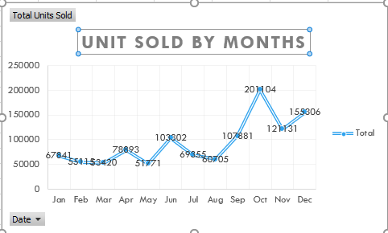

# Excel-Dashboard-for-profit-analysis-of-kevin-cookies-company
# Interactive-Dashboard-of-profit-analysis-of-Kevin-cookie-company
# Background of Kevin's company
 Kevin Company is a multinational corporation founded in 1995. It operates in technology, manufacturing, and services known for its innovation and cutting-edge technology. The company is also involved in philanthropic activities and has a strong commitment to making a positive impact.

# Kevin's company report
This report informs us about the insights of budget, profit, and countries from where the maximum customers invest in the product of the company. The tool Powerbi, visualizes and handles distorted and missing data, converts it into a machine-friendly format, and provides accurate results based on the company's performance. This project involved creating a dashboard in Excel using pivot tables to track the performance of Kevin Cookie Company's products in different markets. The data included the country name, product category, and monthly profit. 

# The dashboard was designed to provide insights into the following key performance :

Profit by Months

Unit Sold by Months (trend)

Unit Sold by Products

Profit by Countries and Product

The dashboard was created using pivot tables, a powerful tool for summarizing and analyzing data. Pivot tables allow you to quickly and easily create interactive charts and graphs that can be used to track trends and identify areas for improvement.

 # The dashboard was created using the following steps:
Import the data into Excel.
Create a pivot table.
Add the desired fields to the pivot table.
Format the pivot table to make it visually appealing.
Create charts and graphs to visualize the data.
The dashboard was completed and met all of the project goals.
The dashboard has helped us better understand their products' performance in different markets. This information has been used to make informed product pricing, marketing, and distribution decisions. As a result, the company has seen an increase in sales and profits.
